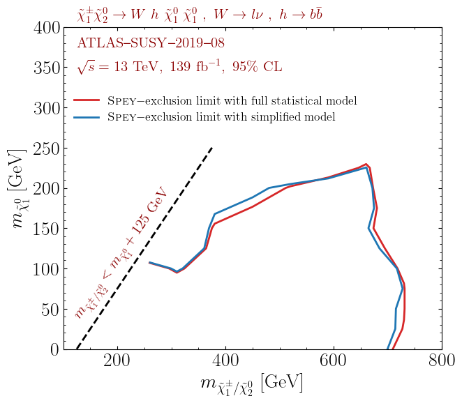

Converting full statistical models to the simplified likelihood framework
=========================================================================

.. meta::
    :property=og:title: Converting full statistical models to the simplified likelihood framework
    :property=og:image: https://spey.readthedocs.io/en/main/_static/spey-logo.png
    :property=og:url: https://spey-pyhf.readthedocs.io/en/main/simplify.html

Although full statistical models contain all the necessary information
to reconstruct the original analysis, it might be computationally costly.
Thus, we implement methodologies to convert full likelihoods into simplified
likelihood frameworks using ``"default_pdf.correlated_background"`` or
``"default_pdf.third_moment_expansion"`` models. Details on the
`simplified models can be found in this link <https://spey.readthedocs.io/en/main/plugins.html#default-pdf-correlated-background>`_.

This particular example requires the installation of three packages, which can be achieved
by using the line below

.. code:: bash

    >>> pip install spey spey-pyhf jax

Methodology
-----------

The Simplified likelihood framework contracts all the nuisance parameters
into a single bin and represents the background uncertainty as a single source.
To capture the correlations between nuisance parameters, one needs to construct
a statistical model only from **control and validation** regions, which is ideally
purely dominated by the background, henceforth called the control model :math:`\mathcal{L}^{c}`.
Once nuisance parameters are fitted for the control model without the signal, one can
compute the covariance matrix between the nuisance parameters using the Hessian of
the negative log probability distribution,

.. math::
    :label: eq:hess

    \mathbf{V}^{-1}_{ij} = - \frac{\partial^2}{\partial\theta_i\partial\theta_j}
    \log\mathcal{L}^{\rm c}(0,\theta_0^{\rm c})

where :math:`\theta_0^{\rm c}` represents the nuisance parameters that maximises
:math:`\mathcal{L}^{\rm c}` at :math:`\mu=0`. Covariance matrix :math:`\mathbf{V}_{ij}`
allows the construction of a multivariate Gaussian distribution
:math:`\mathcal{N}(\theta_0^{\rm c}, \mathbf{V}_{ij})` where one can sample nuisance parameters,
:math:`\tilde{\theta}\sim\mathcal{N}(\theta_0^{\rm c}, \mathbf{V}_{ij})`,
without losing the correlations between them.

.. attention::

	This method is highly dependent on which channels or regions are considered within the control model since
	this will determine how much of the statistical model is summarised as a multivariate (skewed) Gaussian.

It is essential to note that the nuisance parameters of :math:`\mathcal{L}^{\rm c}` does not
necessarily need to match the requested statistical model, which might be reduced compared to the entire model.
For the sake of simplicity, let us call the requested statistical model :math:`\mathcal{L}^{\rm SR}`, but bear
in mind that this model does not necessarily only contain signal regions.
In the case where :math:`|\theta^{\rm SR}|>|\tilde{\theta}^{\rm c}|` the remaining
nuisance parameters are fitted to maximize :math:`\mathcal{L}^{\rm SR}` for a given set of
:math:`\tilde{\theta}^{\rm c}` and :math:`\mu=0`. The remaining nuisance parameters that
maximise this likelihood are :math:`\hat\theta^{\rm SR}`.

The simplified likelihood framework requires a covariance matrix, :math:`\Sigma`, representing
the correlations between each bin for the background-only model.
To construct the covariance matrix, one can sample from :math:`\mathcal{L}^{\rm SR}` using
:math:`\hat\theta^{\rm SR}` and :math:`\tilde{\theta}^{\rm c}`;

.. math::

    \tilde{n}_b \sim \mathcal{L}^{\rm SR}(\mu=0, \tilde{\theta}^{\rm c}, \hat\theta^{\rm SR})

where :math:`\Sigma = {\rm cov}(\tilde{n}_b)` and :math:`n_b=\mathbb{E}[\tilde{n}_b]`. Similarly one
can compute third moments of :math:`\tilde{n}_b` to extend the model for ``"default_pdf.third_moment_expansion"``.

.. seealso::

    Other techniques have been employed to simplify the full statistical models.
    One can find `such a method in this GitHub repository <https://github.com/eschanet/simplify>`_.
    Since this approach provides a ``pyhf`` compatible dictionary as an output, it
    can be directly used with the ``spey-pyhf`` plug-in without additional modifications.
    The method presented here is different from their approach.

Usage
-----

A full statistical model can be constructed using a background-only JSON serialised file
(usually found in the HEPData entry for a given analysis). Details on constructing a full
likelihood through the ``spey-pyhf`` interface can be found in
:ref:`this section <sec_quick_start>`.

As an example, let us use the JSON files provided for ATLAS-SUSY-2019-08 analysis in
`HEPData <https://www.hepdata.net/record/resource/1934827?landing_page=true>`_.
One can read the file using json package

.. code:: python3

    >>> import json
    >>> with open("1Lbb-likelihoods-hepdata/BkgOnly.json", "r") as f:
    >>>	    background_only = json.load(f)
    >>> with open("1Lbb-likelihoods-hepdata/patchset.json", "r") as f:
    >>>     signal = json.load(f)["patches"][0]["patch"]

Following the details in previous sections, a statistical model using ``pyhf`` interface
can be constructed as

.. code:: python3

    >>> pdf_wrapper = spey.get_backend("pyhf")
    >>> full_statistical_model = pdf_wrapper(
    ...     background_only_model=background_only, signal_patch=signal
    ... )
    >>> full_statistical_model.backend.manager.backend = "jax"

where ``background_only`` refers to background-only the JSON file retrieved from HEPData and
``signal`` refers to a signal patch constructed by the user. Note that the computation of the
Hessian in eq. :eq:`eq:hess` currently requires ``pyhf``'s ``jax`` backend, which is ensured
by the last line in the snippet above. ``full_statistical_model`` can be converted into
simplified likelihood by using ``pyhf.simplify`` backend.

.. code:: python3

    >>> converter = spey.get_backend("pyhf.simplify")
    >>> simplified_model = converter(
    ...     statistical_model=full_statistical_model,
    ...     convert_to="default_pdf.correlated_background",
    ...     control_region_indices=[
    ...	        'WREM_cuts', 'STCREM_cuts', 'TRHMEM_cuts', 'TRMMEM_cuts', 'TRLMEM_cuts'
    ...	    ]
    ... )

**Arguments:** (for details see the object reference for :obj:`~spey_pyhf.simplify.Simplify`)

    * ``statistical_model``: Statistical model constructed using ``pyhf`` backend.
    * ``fittype``: Flag to choose what type of fit to be performed. Users can choose between
      ``"postfit"`` and ``"prefit"``.
    * ``convert_to``: Which simplified framework to be used as a baseline for the conversion,
      default ``"default_pdf.correlated_background"``.
    * ``number_of_samples``: Sets the number of samples to be generated to construct covariance
      matrix, :math:`\Sigma`, for the background bins, default ``1000``.
    * ``control_region_indices``: Usually, the algorithm can pick up the differences between signal,
      control and validation regions; however, there is no fixed convention in naming, which leads to
      choosing the wrong channels for the construction of the :math:`\mathcal{L}^{\rm c}`. One can
      overwrite the system selection by providing the indices of the control and validation regions
      within the channel list from the background-only statistical model dictionary. The channel names
      of the ``statistical_model`` can be extracted via ``list(statistical_model.backend.model.channels)``
      property. For details, see :attr:`~spey_pyhf.data.FullStatisticalModelData.channels`.
    * ``include_modifiers_in_control_model``: This flag enables the usage of the signal modifiers in the control model.
      Note that the yield values will still be zero, but the modifiers within the signal model will be copied
      to the control model. This flag allows the contribution of the signal uncertainties in the nuisance
      covariance matrix, as shown in eq. :eq:`eq:hess`.

.. note::

    Possible leakage of signal into control or validation regions is disregarded by setting the signal
    yields to zero while constructing :math:`\mathcal{L}^{\rm c}`. :math:`\tilde{n}_b` does not
    include the auxiliary data; hence, the final statistical model will only include one uncertainty value
    per histogram bin.

Validation
----------

Following the above example, we converted the full likelihood provided for ATLAS-SUSY-2019-08 analysis
into the ``"default_pdf.correlated_background"`` model (for details
`see dedicated documentation <https://speysidehep.github.io/spey/plugins.html#default-plug-ins>`_).
The following results use all available channels for the control model while including the modifiers of the
signal patchset within the control model. Postfit configuration has been used throughout the simulation.
The background yields and covariance matrix of the background-only model have been computed by generating
Five hundred samples from the full statistical model. Scan includes 67 randomly choosen points in
:math:`(m_{\tilde{\chi}^\pm_1/\tilde{\chi}^0_2},m_{\tilde{\chi}_1^0})` mass plane.

The following plot shows the observed exclusion limit comparison for the full statistical model and its simplified
version, mapped on the ``"default_pdf.correlated_background"`` model. Data points only include the
ones provided by the ATLAS collaboration within HEPData.

These results can be reproduced by following the prescription described above. Note that the red curve does not
correspond to the official results since it is plotted only using 67 points. The official results can be reproduced
using the entire patch set provided by the collaboration.

Acknowledgements
----------------

This functionality has been discussed and requested during
`8th (Re)interpretation Forum <https://conference.ippp.dur.ac.uk/event/1178/>`_.
Thanks to Nicholas Wardle, Sabine Kraml and Wolfgang Waltenberger for the lively discussion.
