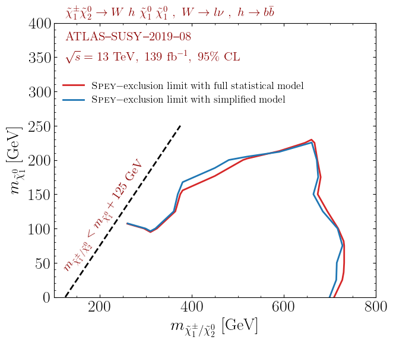

Converting full statistical models to the simplified likelihood framework
=========================================================================

.. meta::
    :property=og:title: Converting full statistical models to the simplified likelihood framework
    :property=og:image: https://spey.readthedocs.io/en/main/_static/spey-logo.png
    :property=og:url: https://spey-pyhf.readthedocs.io/en/main/simplify.html

A full :mod:`pyhf` ``HistFactory`` statistical model carries all the
information necessary to reproduce an LHC analysis. The price to pay is
that evaluating, profiling or sampling such a likelihood is often
prohibitively expensive once the number of nuisance parameters grows
into the hundreds, as is typical for ATLAS or CMS searches. The
:obj:`~spey_pyhf.simplify.Simplify` converter implemented in
``spey-pyhf`` projects a full likelihood onto a substantially cheaper
*simplified-likelihood* form, in which a single combined nuisance
parameter is retained for every analysis bin and all systematic
uncertainties are summarised by the moments of the per-bin background
distribution. Three target backends are supported:

* ``"default.correlated_background"``: Gaussian
  constraint with full bin-to-bin correlation;
* ``"default.third_moment_expansion"``: adds the
  leading skewness correction through a quadratic deformation of the
  expected counts;
* ``"default.effective_sigma"``: Barlow-style
  asymmetric Gaussian for skewed/bounded per-bin uncertainties.

Details on the simplified-likelihood backends themselves are given in
the
`spey default plug-ins documentation
<https://spey.readthedocs.io/en/main/plugins.html#default-plug-ins>`_.

This particular example requires the installation of three packages,
which can be achieved with

.. code:: bash

    >>> pip install spey spey-pyhf jax

The ``jax`` extra is required because the simplification algorithm
queries the Hessian of the log-likelihood through automatic
differentiation.

.. _sec_methodology:

Methodology
-----------

The construction follows the simplified-likelihood framework of
Buckley, Citron, Fichet, Kraml, Waltenberger and Wardle (JHEP 04 (2019)
064, `arXiv:1809.05548 <https://arxiv.org/abs/1809.05548>`_), whose
central result is that an experimental likelihood with :math:`N`
independent elementary nuisance parameters
:math:`\boldsymbol{\delta}` is well approximated, in the regime
:math:`N \geq P` where :math:`P` is the number of analysis bins, by

.. math::
    :label: eq:sl

    \mathcal{L}_S(\boldsymbol{\alpha}, \boldsymbol{\theta})
    = \prod_{I=1}^{P}
      \mathrm{Pois}\!\left(n_I^{\mathrm{obs}} \,\big|\,
        n_{s,I}(\boldsymbol{\alpha}) + a_I + b_I \theta_I + c_I \theta_I^2
      \right)
      \cdot
      \frac{\exp\!\left(-\tfrac{1}{2}\boldsymbol{\theta}^{\mathrm{T}}
                          \boldsymbol{\rho}^{-1}\boldsymbol{\theta}\right)}
           {\sqrt{(2\pi)^P}} .

The :math:`P` combined nuisance parameters
:math:`\boldsymbol{\theta} = (\theta_1, \dots, \theta_P)`, one per
bin, replace the much larger set of elementary
:math:`\boldsymbol{\delta}` and are unit-variance, centred Gaussians
correlated through the :math:`P \times P` matrix
:math:`\boldsymbol{\rho}`. The coefficients
:math:`(a_I, b_I, c_I, \rho_{IJ})` are obtained by matching the first
three central moments of the per-bin background expectation
:math:`\tilde{n}_b = a + b\theta + c\theta^2` (at :math:`\mu = 0`) to
the corresponding moments of the full likelihood (Buckley *et al.*
eqs. 2.6--2.8):

.. math::
    :label: eq:moments

    m_{1,I}  &= a_I + c_I , \\
    m_{2,IJ} &= b_I b_J \rho_{IJ} + 2 c_I c_J \rho_{IJ}^{\,2} , \\
    m_{3,I}  &= 6\,b_I^{\,2} c_I + 8\,c_I^{\,3} .

Inverting these relations (Buckley *et al.* eqs. 2.9--2.12) yields the
simplified-likelihood parameters as closed-form functions of the
moments:

.. math::
    :label: eq:inversion

    c_I    &= -\mathrm{sign}(m_{3,I}) \sqrt{2\,m_{2,II}}\,
              \cos\!\left[
                \frac{4\pi}{3} + \frac{1}{3}\,
                \arctan\!\sqrt{8\,\frac{m_{2,II}^{\,3}}{m_{3,I}^{\,2}} - 1}
              \right] , \\
    b_I    &= \sqrt{m_{2,II} - 2 c_I^{\,2}} , \\
    a_I    &= m_{1,I} - c_I , \\
    \rho_{IJ} &= \frac{1}{4\,c_I c_J}\,
                 \left(\sqrt{(b_I b_J)^2 + 8\,c_I c_J\,m_{2,IJ}}
                       - b_I b_J\right) .

These expressions are valid as long as
:math:`8\,m_{2,II}^{\,3} \geq m_{3,I}^{\,2}`, i.e. the bin-wise skewness
is small enough for the quadratic expansion to be invertible. When the
third moment :math:`m_{3,I}` vanishes the quadratic term drops out
(:math:`c_I \rightarrow 0`) and eq. :eq:`eq:sl` reduces to the standard
simplified likelihood used by
``"default.correlated_background"``, with
:math:`a_I = m_{1,I}`, :math:`b_I = \sqrt{m_{2,II}}` and
:math:`\rho_{IJ} = m_{2,IJ} / (b_I b_J)`, the Pearson correlation of
:math:`\Sigma \equiv m_2`. The full quadratic form is implemented by
``"default.third_moment_expansion"``.

For asymmetric per-bin uncertainties the same combined-parameter
strategy is used, but the linear term :math:`\theta_I\,\sigma_I` in the
expected count is replaced by Barlow's variable-Gaussian prescription
(`arXiv:physics/0406120 <https://arxiv.org/abs/physics/0406120>`_,
Sec. 3.6):

.. math::
    :label: eq:effsig

    \sigma^{\mathrm{eff}}_I(\theta_I)
    = \sqrt{\sigma^{+}_I\,\sigma^{-}_I
            + (\sigma^{+}_I - \sigma^{-}_I)(\theta_I - n^{b}_I)} ,

so that the conditional standard deviation interpolates smoothly
between the upper (:math:`\sigma^{+}`) and lower (:math:`\sigma^{-}`)
absolute uncertainties of the bin. This is the form used by
``"default.effective_sigma"``; when
:math:`\sigma^{+} = \sigma^{-}` the effective sigma reduces to the
symmetric value and one recovers the standard simplified likelihood.

Extracting the moments from a ``pyhf`` model
~~~~~~~~~~~~~~~~~~~~~~~~~~~~~~~~~~~~~~~~~~~~

In analyses where the analytical relationship between elementary and
combined nuisance parameters is opaque, which is the typical case
for ``pyhf`` workspaces, Buckley *et al.* Sec. 4 advocate extracting
:math:`(m_1, m_2, m_3)` by Monte-Carlo. The
:obj:`~spey_pyhf.simplify.Simplify` converter realises this in five
steps.

**Step 1: Control likelihood.** A control likelihood
:math:`\mathcal{L}^{c}` is built from the background-only :mod:`pyhf`
workspace by attaching a zero-yield ``"Signal"`` sample to every
channel listed in ``control_region_indices``. The remaining channels
keep their background-only structure. The parameter of interest
:math:`\mu` is retained in the workspace, but the resulting model has
zero signal yields everywhere when :math:`\mu = 0`, so
:math:`\mathcal{L}^{c}` collapses to a background-only fit at that
point. The ``control_region_indices`` argument selects the channels in
which the (zero-valued) signal sample, and optionally the *signal
modifiers*, are introduced, which controls whether signal-induced
systematics enter the constraint covariance computed below.

.. attention::

    The shape of :math:`\boldsymbol{\rho}`, and thus the quality of
    the simplification, depends sensitively on which channels are
    declared as control/validation regions and on whether the signal
    modifiers are propagated. Channels in which a potential signal
    overlaps with the background fit can bias the nuisance MLE; the
    convention adopted here, following the original simplified-likelihood
    proposal, is to compute the nuisance covariance from regions that
    are expected to be signal-free or signal-depleted.

**Step 2: Conditional MLE.** :math:`\mathcal{L}^{c}` is profiled at
:math:`\mu = 0` to obtain the conditional best-fit nuisance vector
:math:`\hat{\boldsymbol{\theta}}_0^{c}`. This is the maximum-likelihood
point of the background-only fit consistent with no signal contribution.

**Step 3: Nuisance covariance.** Once
:math:`\hat{\boldsymbol{\theta}}_0^{c}` is found, the observed Fisher
information is read off the Hessian of the negative log-likelihood,

.. math::
    :label: eq:hess

    V^{-1}_{ij}
    = -\,\frac{\partial^{2} \log\mathcal{L}^{c}}{\partial\theta_i\,\partial\theta_j}
      \bigg|_{(\mu,\,\boldsymbol{\theta})
              = (0,\,\hat{\boldsymbol{\theta}}_0^{c})} ,

where the row and column corresponding to :math:`\mu` are removed
before the inversion. The resulting matrix :math:`\mathbf{V}` is the
asymptotic covariance of the nuisance parameters at the conditional
MLE, and it captures all linear correlations between them.

**Step 4: Nuisance sampling.** A multivariate Gaussian
:math:`\mathcal{N}(\hat{\boldsymbol{\theta}}_0^{c}, \mathbf{V})` is
constructed, and nuisance draws
:math:`\tilde{\boldsymbol{\theta}} \sim
\mathcal{N}(\hat{\boldsymbol{\theta}}_0^{c}, \mathbf{V})` are sampled
from it without losing the correlations between elementary nuisance
parameters.

It is important to note that the nuisance parameters of
:math:`\mathcal{L}^{c}` need not match exactly those of the requested
full statistical model :math:`\mathcal{L}^{\mathrm{SR}}`, which may
carry additional modifiers that are absent from the control regions.
When :math:`|\boldsymbol{\theta}^{\mathrm{SR}}| >
|\tilde{\boldsymbol{\theta}}^{c}|` the missing entries are profiled by
maximising :math:`\mathcal{L}^{\mathrm{SR}}` at :math:`\mu = 0` with the
shared entries held at :math:`\tilde{\boldsymbol{\theta}}^{c}` through
equality constraints. The resulting maximiser
:math:`\hat{\boldsymbol{\theta}}^{\mathrm{SR}}` together with
:math:`\tilde{\boldsymbol{\theta}}^{c}` provides a complete nuisance
vector that can be evaluated on :math:`\mathcal{L}^{\mathrm{SR}}`.

**Step 5: Per-bin sampling.** Each accepted parameter vector is
forwarded to the :mod:`pyhf` sampler of
:math:`\mathcal{L}^{\mathrm{SR}}` to draw one Poisson realisation per
bin,

.. math::
    :label: eq:sampler

    \tilde{n}_b
    \sim \mathcal{L}^{\mathrm{SR}}\!\left(\mu = 0,\,
        \tilde{\boldsymbol{\theta}}^{c},\,
        \hat{\boldsymbol{\theta}}^{\mathrm{SR}}\right) ,

with the auxiliary data deliberately excluded so that the resulting
samples encode only the per-bin background expectation propagated
through the nuisance fluctuations. Samples that would require drawing
from a Poisson with non-positive rate are rejected and the loop
continues until ``number_of_samples`` accepted samples are collected.

**Estimating the moments.** Given the matrix of samples, the
simplified-likelihood inputs are obtained as

.. math::

    m_1 &= \mathbb{E}[\tilde{n}_b] , \\
    \Sigma &\equiv m_2 = \mathrm{cov}(\tilde{n}_b) , \\
    m_3 &= \mathbb{E}\!\left[(\tilde{n}_b - m_1)^3\right] .

The per-bin background expectation passed to the simplified-likelihood
backend is therefore the *sample mean* :math:`m_1`, not the original
yield from the :mod:`pyhf` workspace, the simplified framework treats
:math:`m_{1,I}` as the first moment of the bin distribution. For
`"default.effective_sigma"` the
:math:`(m_1, \Sigma)` summary is supplemented by the 68% sample
quantiles that define the per-bin asymmetric envelope,

.. math::

    \sigma^{+}_I &= |\,Q_{0.8413}(\tilde{n}_{b,I}) - m_{1,I}\,| , \\
    \sigma^{-}_I &= |\,m_{1,I} - Q_{0.1587}(\tilde{n}_{b,I})\,| ,

where :math:`Q_p` denotes the empirical :math:`p`-quantile (the
:math:`\pm 1\sigma` quantiles of a standard normal). The covariance
:math:`\Sigma` is then reduced to the corresponding Pearson correlation
matrix :math:`\rho_{IJ} = \Sigma_{IJ}/\sqrt{\Sigma_{II}\,\Sigma_{JJ}}`,
which is passed to `"default.effective_sigma"`
together with the asymmetric envelope.

.. note::

    Possible leakage of signal into control or validation regions is
    disregarded by setting the signal yields to zero while constructing
    :math:`\mathcal{L}^{c}`. The per-bin samples :math:`\tilde{n}_b`
    are drawn without auxiliary data, hence the resulting simplified
    statistical model contains a single nuisance parameter per bin
    summarising all systematic uncertainties.

.. seealso::

    Other techniques have been employed to simplify full statistical
    models. One example is the
    `eschanet/simplify <https://github.com/eschanet/simplify>`_ tool,
    which produces a ``pyhf``-compatible JSON patch by collapsing the
    post-fit background of a workspace into a single sample. Its output
    can be loaded directly with the ``spey-pyhf`` plug-in without
    additional modifications. The approach implemented here is
    different in that it samples the full likelihood and matches
    moments of the resulting per-bin distribution rather than freezing
    nuisance parameters at their post-fit values.

Usage
-----

A full statistical model can be constructed using a background-only
JSON-serialised file (typically found in the HEPData entry for a given
analysis). Details on constructing a full likelihood through the
``spey-pyhf`` interface can be found in
:ref:`this section <sec_quick_start>`.

As an example, let us use the JSON files provided for the
ATLAS-SUSY-2019-08 analysis on
`HEPData <https://www.hepdata.net/record/resource/1934827?landing_page=true>`_.
The files can be read using the standard ``json`` module:

.. code:: python3

    >>> import json
    >>> with open("1Lbb-likelihoods-hepdata/BkgOnly.json", "r") as f:
    >>>	    background_only = json.load(f)
    >>> with open("1Lbb-likelihoods-hepdata/patchset.json", "r") as f:
    >>>     signal = json.load(f)["patches"][0]["patch"]

Following the details in the previous sections, a statistical model
using the ``pyhf`` interface can be constructed as

.. code:: python3

    >>> import spey
    >>> pdf_wrapper = spey.get_backend("pyhf")
    >>> full_statistical_model = pdf_wrapper(
    ...     background_only_model=background_only, signal_patch=signal
    ... )
    >>> full_statistical_model.backend.manager.backend = "jax"

where ``background_only`` is the background-only JSON file retrieved
from HEPData and ``signal`` is a signal patch. The last line enables
``pyhf``'s ``jax`` backend, which is required for the Hessian
computation in eq. :eq:`eq:hess`. ``full_statistical_model`` can then
be converted into a simplified likelihood with the ``pyhf.simplify``
backend:

.. code:: python3

    >>> converter = spey.get_backend("pyhf.simplify")
    >>> simplified_model = converter(
    ...     statistical_model=full_statistical_model,
    ...     convert_to="default.correlated_background",
    ...     control_region_indices=[
    ...	        'WREM_cuts', 'STCREM_cuts', 'TRHMEM_cuts', 'TRMMEM_cuts', 'TRLMEM_cuts'
    ...	    ]
    ... )

**Arguments:** (for details see the object reference for
:obj:`~spey_pyhf.simplify.Simplify`)

    * ``statistical_model``: full statistical model constructed using
      the ``pyhf`` backend with the ``jax`` backend enabled.
    * ``fittype``: which expectation type is used when constructing and
      profiling the control model. ``"postfit"`` uses the observed
      auxiliary data, ``"prefit"`` uses the pre-fit auxiliary data.
    * ``convert_to``: target simplified-likelihood backend, one of
      ``"default.correlated_background"``,
      ``"default.third_moment_expansion"`` or
      ``"default.effective_sigma"``. Default is
      ``"default.correlated_background"``.
    * ``number_of_samples``: number of accepted Monte-Carlo samples
      used to estimate :math:`m_1`, :math:`\Sigma` (and where relevant
      :math:`m_3` or the asymmetric quantile envelope). Default
      ``1000``.
    * ``control_region_indices``: indices or names of the control and
      validation regions in the background-only workspace. The
      algorithm includes a substring-based heuristic that detects
      channel names containing ``CR`` or ``VR``, but the convention
      varies between collaborations and the heuristic can fail. The
      channel names of the ``statistical_model`` can be read from
      ``list(statistical_model.backend.model.channels)``; see
      :attr:`~spey_pyhf.data.FullStatisticalModelData.channels`.
    * ``include_modifiers_in_control_model``: when ``True``, the signal
      modifiers are attached to the zero-yield signal samples injected
      into the control regions, so that signal-induced systematics
      contribute to :math:`\mathbf{V}` in eq. :eq:`eq:hess`. Default
      ``False``.

Saving and restoring the simplified model
~~~~~~~~~~~~~~~~~~~~~~~~~~~~~~~~~~~~~~~~~

The Monte-Carlo extraction is the most expensive step of the
conversion. To avoid having to repeat it, the ``save_model`` argument
of :obj:`~spey_pyhf.simplify.Simplify` writes the extracted summary
statistics to a compressed NumPy archive that can be reloaded with
:func:`numpy.load`. The archive always contains the channel order, the
per-bin observed data, the per-bin sample mean (the simplified-likelihood
background yields :math:`m_{1,I}`) and the per-bin covariance matrix
:math:`\Sigma`; for ``"default.third_moment_expansion"`` it additionally
contains the diagonal third moments :math:`m_{3,I}`, and for
``"default.effective_sigma"`` the asymmetric envelopes
:math:`(\sigma^{+}_I, \sigma^{-}_I)`.

Validation
----------

Following the example above, we converted the full likelihood provided
for the ATLAS-SUSY-2019-08 analysis into the
``"default.correlated_background"`` model (see the
`dedicated documentation
<https://speysidehep.github.io/spey/plugins.html#default-plug-ins>`_
for the target model). The results below use all available channels in
the control model and include the modifiers of the signal patchset
inside the control model. The postfit configuration is used throughout
the simulation. The background yields and covariance matrix of the
background-only model were computed from 500 samples drawn from the
full statistical model. The scan includes 67 randomly chosen points in
the
:math:`(m_{\tilde{\chi}^\pm_1/\tilde{\chi}^0_2},\,m_{\tilde{\chi}_1^0})`
mass plane.

The following plot shows the observed exclusion limit comparison
between the full statistical model and its simplified version mapped
onto the ``"default.correlated_background"`` backend. Data points only
include those provided by the ATLAS collaboration on HEPData.

These results can be reproduced by following the prescription above.
Note that the red curve does not correspond to the official results,
because it is plotted from only 67 mass points; the official limit can
be reproduced using the full patch set provided by the collaboration.

.. _sec_eschanet_comparison:

Comparison with :mod:`pyhf`'s in-house simplification tool
----------------------------------------------------------

The ``eschanet/simplify`` tool
(`<https://github.com/eschanet/simplify>`_; see also the ATLAS PUB note
`ATL-PHYS-PUB-2021-038 <https://cds.cern.ch/record/2782654>`_)
implements an alternative path from a :mod:`pyhf` ``HistFactory``
workspace to a compact statistical model. Because its output is itself
a :mod:`pyhf` workspace, it can be loaded directly through the
:mod:`spey-pyhf` interface without going through the converter
described in this page. The two methods solve the same problem,
trading the long list of elementary nuisance parameters for one bin-wise
uncertainty source, but the simplifications they apply are different
and lead to different statistical models. The comparison below is
intended to make the differences explicit so that users can pick the
approximation that matches their use case.

Reference setup
~~~~~~~~~~~~~~~

Let :math:`\nu_I(\boldsymbol{\theta})` denote the per-bin total
expected count of the full :mod:`pyhf` model, where
:math:`\boldsymbol{\theta} = (\theta_1, \dots, \theta_N)` collects all
elementary nuisance parameters. After fitting the full model one
obtains the maximum-likelihood estimate
:math:`\hat{\boldsymbol{\theta}}` and the corresponding parameter
covariance :math:`\mathbf{C} \in \mathbb{R}^{N\times N}` (with
:math:`\sigma_i \equiv \sqrt{C_{ii}}` and Pearson correlation
:math:`r_{ij} = C_{ij}/(\sigma_i\sigma_j)`). The two methods use this
information differently.

``eschanet/simplify``: post-fit linearised error propagation
~~~~~~~~~~~~~~~~~~~~~~~~~~~~~~~~~~~~~~~~~~~~~~~~~~~~~~~~~~~~

For every parameter :math:`\theta_i` the implementation computes a
symmetric finite-difference variation of the per-bin expectation:

.. math::
    :label: eq:eschanet_delta

    \Delta_{I,i}
    = \frac{
        \nu_I\!\left(\hat{\boldsymbol{\theta}} + \sigma_i\,\hat{e}_i\right)
      - \nu_I\!\left(\hat{\boldsymbol{\theta}} - \sigma_i\,\hat{e}_i\right)
      }{2} ,

with :math:`\hat{e}_i` the unit vector along :math:`\theta_i`. In the
limit of small :math:`\sigma_i` this is exactly the first-order Taylor
coefficient :math:`\Delta_{I,i} \simeq \sigma_i\,\partial\nu_I/\partial\theta_i`.
The total per-bin variance is then obtained by linearised error
propagation through the post-fit correlation matrix:

.. math::
    :label: eq:eschanet_var

    \sigma_{b,I}^{2}
    = \sum_{i=1}^{N} \Delta_{I,i}^{\,2}
      + 2 \sum_{i>j} r_{ij}\,\Delta_{I,i}\,\Delta_{I,j} ,

equivalent in matrix form to
:math:`\sigma_{b,I}^{2} = \boldsymbol{\Delta}_{I}^{\mathrm{T}}\,
\mathbf{R}\,\boldsymbol{\Delta}_{I}`, where
:math:`\mathbf{R}` is the post-fit correlation matrix and
:math:`\boldsymbol{\Delta}_{I}` is the column vector of finite-difference
slopes for bin :math:`I`. Pairs of pure ``staterror`` parameters are
treated as uncorrelated by convention.

The output workspace contains one channel per surviving channel of the
original model, each with a single ``"Bkg"`` sample whose nominal yield
is the post-fit prediction
:math:`\nu_I(\hat{\boldsymbol{\theta}})` and a single ``histosys``
modifier named ``totalError`` with templates

.. math::
    :label: eq:eschanet_template

    \nu^{\pm}_{I} = \nu_I(\hat{\boldsymbol{\theta}}) \pm \sigma_{b,I} .

The likelihood evaluated on this workspace is, schematically,

.. math::
    :label: eq:eschanet_lik

    \mathcal{L}_{\mathrm{esh}}(\mu, \boldsymbol{\theta})
    = \prod_{I=1}^{P}
      \mathrm{Pois}\!\left(n_I^{\mathrm{obs}} \,\big|\,
        \mu\,n^{s}_I + \nu_I(\hat{\boldsymbol{\theta}})
        + \sigma_{b,I}\,\theta_I^{\mathrm{tot}}\right)
      \cdot
      \prod_{I=1}^{P}\mathcal{N}\!\left(0\,\big|\,\theta_I^{\mathrm{tot}},\,1\right) ,

where each :math:`\theta_I^{\mathrm{tot}}` is the nuisance parameter
associated with the ``totalError`` modifier of bin :math:`I` and the
``histosys`` interpolation provides the linear morphing between
:math:`\nu_I` and :math:`\nu^{\pm}_{I}` consistent with eq.
:eq:`eq:eschanet_template`.

``spey-pyhf.simplify``: Monte-Carlo moment extraction
~~~~~~~~~~~~~~~~~~~~~~~~~~~~~~~~~~~~~~~~~~~~~~~~~~~~~

The converter implemented here, by contrast, samples
:math:`\tilde{\boldsymbol{\theta}}` from the constraint
:math:`\mathcal{N}(\hat{\boldsymbol{\theta}}_0^{c}, \mathbf{V})` and
*propagates each draw through the full likelihood* before estimating
the moments of the resulting per-bin distribution:

.. math::
    :label: eq:speypyhf_moments

    m_{1,I}  &= \mathbb{E}\!\left[\,\nu_I(\tilde{\boldsymbol{\theta}})\,\right] , \\
    m_{2,IJ} &= \mathrm{cov}\!\left[\,\nu_I(\tilde{\boldsymbol{\theta}}),\,
                                       \nu_J(\tilde{\boldsymbol{\theta}})\,\right] , \\
    m_{3,I}  &= \mathbb{E}\!\left[\,
                 \left(\nu_I(\tilde{\boldsymbol{\theta}}) - m_{1,I}\right)^{3}\,\right] .

These moments feed eqs. :eq:`eq:moments` and :eq:`eq:inversion` to
produce the
:class:`~spey.backends.default_pdf.CorrelatedBackground` or
:class:`~spey.backends.default_pdf.ThirdMomentExpansion` simplified
likelihood, eq. :eq:`eq:sl`. The mapping is fully described in
:ref:`Methodology <sec_methodology>` above; for the asymmetric variant
the Barlow effective-:math:`\sigma`, eq. :eq:`eq:effsig`, is used
instead.

Side-by-side
~~~~~~~~~~~~

The following table summarises the differences.

.. list-table::
   :header-rows: 1
   :widths: 28 36 36

   * - Aspect
     - ``eschanet/simplify``
     - ``spey-pyhf.simplify``
   * - Order of approximation
     - First-order Taylor expansion of
       :math:`\nu_I(\boldsymbol{\theta})` around
       :math:`\hat{\boldsymbol{\theta}}`, eq.
       :eq:`eq:eschanet_delta`.
     - Non-linear propagation through Monte-Carlo: full evaluation of
       :math:`\nu_I(\tilde{\boldsymbol{\theta}})` for each draw, eq.
       :eq:`eq:speypyhf_moments`.
   * - Where the fit is performed
     - Global fit of the full likelihood (signal + background, or
       background-only).
     - Background-only profile of a control likelihood
       :math:`\mathcal{L}^{c}` at :math:`\mu = 0`, eq. :eq:`eq:hess`.
   * - Parameter covariance source
     - Post-fit covariance :math:`\mathbf{C}` from MINUIT (HESSE) on the
       full model.
     - Observed Fisher information :math:`\mathbf{V}` evaluated via
       JAX automatic differentiation on :math:`\mathcal{L}^{c}`, eq.
       :eq:`eq:hess`.
   * - Per-bin uncertainty
     - Symmetric Gaussian:
       :math:`\sigma_{b,I}^{2} = \boldsymbol{\Delta}_{I}^{\mathrm{T}}
       \mathbf{R}\,\boldsymbol{\Delta}_{I}`, eq. :eq:`eq:eschanet_var`.
     - First two (optionally three) central moments
       :math:`(m_{1,I}, m_{2,II}, m_{3,I})`, or the empirical 68 %
       quantiles for `"default.effective_sigma"`.
   * - Bin-to-bin correlation
     - **Absent.** Each bin receives an independent ``histosys``
       constraint with unit-width Gaussian prior; off-diagonal
       :math:`m_{2,IJ}` information is dropped.
     - **Retained** in :math:`m_{2,IJ}` and propagated to the
       multivariate-Gaussian constraint
       :math:`\boldsymbol{\theta} \sim \mathcal{N}(\mathbf{0},\boldsymbol{\rho})`.
   * - Skewness / asymmetry
     - Not represented; the variable-Gaussian envelope is symmetric.
     - Optional via :math:`m_{3,I}`, eqs. :eq:`eq:moments` and
       :eq:`eq:inversion`, or via the asymmetric quantile envelope
       :math:`(\sigma^{+}_I, \sigma^{-}_I)` of eq. :eq:`eq:effsig`.
   * - Treatment of staterror×staterror correlations
     - Forced to zero, regardless of the entry of :math:`\mathbf{R}`.
     - Preserved through the Hessian of :math:`\mathcal{L}^{c}` and the
       multivariate-Gaussian sampling.
   * - Output format
     - A :mod:`pyhf` ``HistFactory`` JSON patch (one ``Bkg`` sample
       plus one ``histosys`` modifier per channel) consumable by any
       :mod:`pyhf` front-end.
     - A native :mod:`spey` simplified-likelihood model
       (:class:`~spey.backends.default_pdf.CorrelatedBackground`,
       :class:`~spey.backends.default_pdf.ThirdMomentExpansion` or
       ``"default.effective_sigma"``).
   * - Dominant computational cost
     - :math:`\mathcal{O}(N)` evaluations of :math:`\nu_I` (one
       symmetric pair per nuisance parameter).
     - :math:`\mathcal{O}(M)` full-model evaluations, where :math:`M`
       is ``number_of_samples``, plus one Hessian.

Relationship in a common limit
~~~~~~~~~~~~~~~~~~~~~~~~~~~~~~

In the regime where the post-fit log-likelihood is well approximated by
a multivariate Gaussian in :math:`\boldsymbol{\theta}`, both methods
estimate the same first two moments of
:math:`\nu_I(\boldsymbol{\theta})`. Indeed, linearising
:math:`\nu_I(\boldsymbol{\theta}) \simeq \nu_I(\hat{\boldsymbol{\theta}})
+ \mathbf{g}_I^{\mathrm{T}} \delta\boldsymbol{\theta}` with
:math:`\mathbf{g}_{I,i} \equiv \partial\nu_I/\partial\theta_i` and
sampling :math:`\delta\boldsymbol{\theta} \sim \mathcal{N}(0, \mathbf{C})`
gives

.. math::
    :label: eq:limit

    m_{1,I} \xrightarrow{\text{linear}} \nu_I(\hat{\boldsymbol{\theta}}) ,
    \qquad
    m_{2,IJ}
    \xrightarrow{\text{linear}}
    \mathbf{g}_I^{\mathrm{T}} \mathbf{C}\, \mathbf{g}_J
    \;=\; \sum_{i,j} C_{ij}\,
        \frac{\partial\nu_I}{\partial\theta_i}\,
        \frac{\partial\nu_J}{\partial\theta_j} ,
    \qquad
    m_{3,I} \xrightarrow{\text{linear}} 0 .

The ``eschanet/simplify`` per-bin variance, eq. :eq:`eq:eschanet_var`,
is precisely the diagonal :math:`I = J` of this expression with the
gradients replaced by central finite differences. The two approaches
therefore coincide on the diagonal of
:math:`m_2`, up to the discretisation of the finite difference and
the choice of fit (control vs. global), when the model is locally
linear in :math:`\boldsymbol{\theta}` and the elementary nuisance
parameters are jointly Gaussian. They part ways whenever any of the
following is non-negligible:

* **Non-linearity** in :math:`\nu_I(\boldsymbol{\theta})` (e.g.
  ``histosys`` interpolation outside the linear regime, large
  ``normsys`` shifts, log-normal lumi-style modifiers): the Taylor
  expansion drops :math:`\mathcal{O}(\delta\theta^2)` corrections that
  the Monte-Carlo retains exactly.
* **Bin-to-bin correlation**: only the off-diagonal :math:`m_{2,IJ}`
  retained by ``spey-pyhf`` couples bins; ``eschanet/simplify`` decouples
  them by construction.
* **Skewness / boundedness**: positivity of yields, asymmetric
  ``histosys`` templates, or visibly skewed post-fit distributions
  generate non-zero :math:`m_{3,I}` and asymmetric quantiles that
  ``"default.third_moment_expansion"`` and
  ``"default.effective_sigma"`` use, but that
  ``eschanet/simplify`` discards.

Which approximation to use therefore depends on whether bin correlations
and higher-order effects matter for the analysis at hand. When they do
not, the lightweight :mod:`pyhf` patch produced by ``eschanet/simplify``
is sufficient; when they do, the moment-based reduction implemented
here preserves the relevant information at the cost of an additional
Monte-Carlo pass.

References
----------

* A. Buckley, M. Citron, S. Fichet, S. Kraml, W. Waltenberger and
  N. Wardle, *The Simplified Likelihood Framework*, JHEP 04 (2019) 064,
  `arXiv:1809.05548 <https://arxiv.org/abs/1809.05548>`_. Defines the
  simplified likelihood, the moment-matching parameters and the
  Monte-Carlo extraction procedure used here.
* R. Barlow, *Asymmetric Errors*,
  `arXiv:physics/0406120 <https://arxiv.org/abs/physics/0406120>`_,
  Sec. 3.6. Source of the variable-Gaussian effective-:math:`\sigma`
  form consumed by `"default.effective_sigma"`.
* E. Schanet, ``simplify`` package
  (`<https://github.com/eschanet/simplify>`_). Complementary tool that
  emits a :mod:`pyhf`-compatible JSON patch by freezing the post-fit
  background into a single sample.

Acknowledgements
----------------

This functionality has been discussed and requested during the
`8th (Re)interpretation Forum <https://conference.ippp.dur.ac.uk/event/1178/>`_.
Thanks to Nicholas Wardle, Sabine Kraml and Wolfgang Waltenberger for
the lively discussion.
